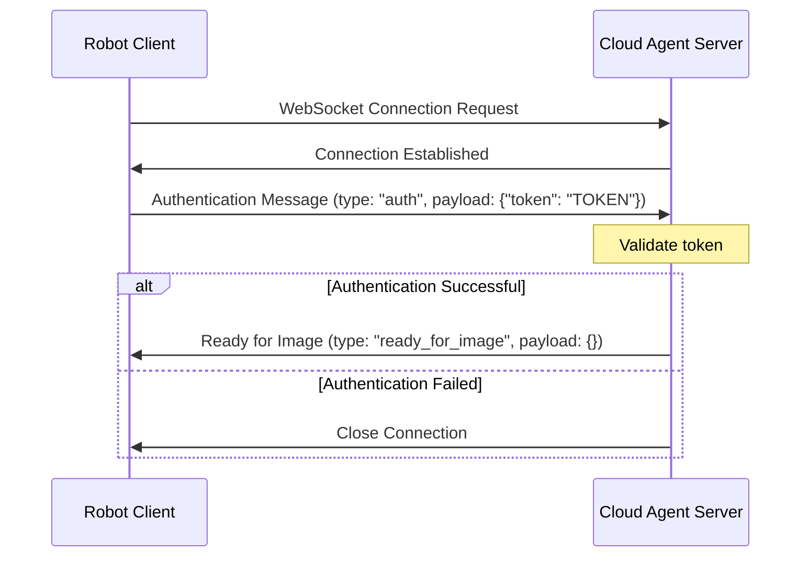
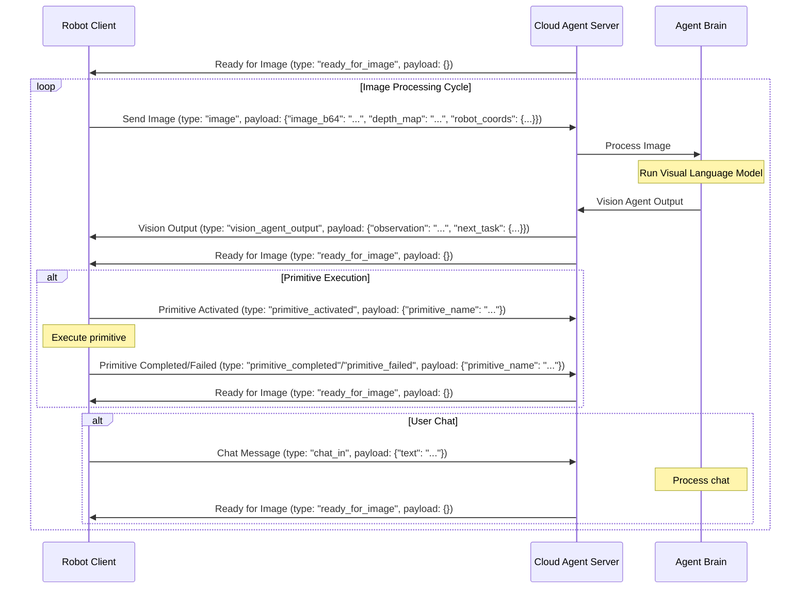

# Cloud Agent

## Build and test locally

```bash
python3 -m venv venv
source venv/bin/activate
pip install -r requirements.txt
```

## Build and run the Docker image

Standard mode (memory commands disabled):
```bash
docker compose -f docker-compose.local.yml build
docker compose -f docker-compose.local.yml up
```

Benchmark mode (memory commands enabled):
```bash
docker compose -f docker-compose.benchmark.yml build
docker compose -f docker-compose.benchmark.yml up
```

### Memory State Management

Cloud Agent includes a memory state management feature that allows saving and loading brain states. This feature is:
- **Disabled** by default in `docker-compose.local.yml`
- **Enabled** by default in `docker-compose.benchmark.yml`

To enable memory state management when running locally:

```bash
python run_server.py --enable-memory-commands
```

#### Memory Commands (when enabled)

When memory state management is enabled, the following commands are available via chat:

- `!save_memory NAME` - Saves the current brain state (history and pose graph memory)
- `!load_memory NAME` - Loads a previously saved brain state
- `!list_memory` - Lists all available saved memory states

You can also provide a `memory_state` parameter in reset messages to load a specific state:

```python
reset_msg = MessageIn(
    type=MessageInType.RESET, payload={"memory_state": "your_state_name"}
)
```

## Build and deploy the Cloud Run service

### Build the Docker image

```bash
docker build \
  --platform=linux/amd64 \
  -t us-central1-docker.pkg.dev/innate-agent/innate-agent-websocket-server/agent-ws-server-image:v1.1 \
  .
```

### Push the Docker image to Google Cloud Container Registry

```bash
docker push us-central1-docker.pkg.dev/innate-agent/innate-agent-websocket-server/agent-ws-server-image:v1.1
```

### Deploy the Cloud Run service

```bash
gcloud run deploy agent-ws-server \
  --image us-central1-docker.pkg.dev/innate-agent/innate-agent-websocket-server/agent-ws-server-image:v1.0.1 \
  --platform managed \
  --region us-central1 \
  --port 8765
```

### Test the Cloud Run service

Use the test_ws_server.py script to test the Cloud Run service.

```bash
python3 test_ws_server.py
```

## WebSocket Protocol

The Cloud Agent uses a WebSocket-based protocol for communication between the client (robot) and the server (cloud agent). The protocol consists of a handshake phase followed by an ongoing image exchange and command flow.

### Connection and Handshake Protocol

The handshake protocol establishes the connection and authenticates the client:



### Image Exchange and Command Flow

After successful authentication, the protocol follows this pattern:



### Message Types

#### Incoming Messages (Client to Server)
- `auth`: Authentication with token
- `image`: Image data with optional depth map and robot coordinates
- `chat_in`: User chat message
- `primitive_activated`: Notification that a primitive has started execution
- `primitive_completed`: Notification that a primitive has completed successfully
- `primitive_failed`: Notification that a primitive has failed
- `primitive_interrupted`: Notification that a primitive was interrupted
- `register_primitives_and_directive`: Register new primitives and/or directive

#### Outgoing Messages (Server to Client)
- `ready_for_image`: Server is ready to receive a new image
- `vision_agent_output`: Result of processing an image, including observations and next task
- `chat_out`: Chat message from the agent to the user
- `thoughts`: Internal thoughts/reasoning from the agent
- `primitives_and_directive_registered`: Confirmation of primitive/directive registration

### Primitive Execution Flow

When the agent decides to execute a primitive:

1. The server sends a `vision_agent_output` with a `next_task` field containing the primitive details
2. The client executes the primitive and sends a `primitive_activated` message
3. After execution, the client sends either `primitive_completed` or `primitive_failed`
4. The server responds with `ready_for_image` to continue the cycle

This protocol enables continuous visual feedback and command execution between the robot client and the cloud agent.
